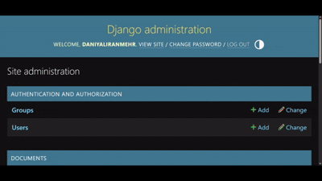

# Document Question Answering System (RAG-based AI Assistant)

## Project Description

This project is an AI-powered Document Question Answering System developed using Django, LangChain, and Retrieval-Augmented Generation (RAG). The system allows users to upload and manage DOCX documents, automatically extract and process their content, and ask natural language questions based on the uploaded documents.

To improve answer quality, the documents are semantically divided into smaller chunks and converted into vector embeddings, which are stored and searched using FAISS. When a question is submitted, the system retrieves the most relevant parts of the documents through semantic similarity search and provides a context-aware answer using a Large Language Model (LLM) connected through the OpenRouter API.

The entire workflow, including document management, question submission, and answer history tracking, is handled through the Django Admin panel.

## Key Features

- Upload and manage DOCX documents
- Automatic text extraction from uploaded files
- Semantic document chunking
- Vector-based similarity search using FAISS
- Retrieval-Augmented Generation (RAG) pipeline
- Natural language question answering with LLMs
- Question and answer history tracking
- Django Admin-based management interface
- API support for document management and question answering
- LangChain integration for LLM orchestration

## Demo

### Add Document

<p align="center">
  
</p>

### Ask Question

<p align="center">
  
</p>

## Tech Stack

### Backend
- Python
- Django

### AI System
- LangChain
- Retrieval-Augmented Generation (RAG)
- FAISS
- HuggingFace Embeddings
- OpenRouter API

### Database
- SQLite

### Deployment
- Docker
- Docker Compose

## System Architecture

The project follows a modular Django-based architecture composed of two main applications: `documents` and `qa`, along with a FAISS-based vector store for semantic retrieval.

---

### QA Application Overview

The `qa` application is responsible for the core question-answering functionality of the system. It implements a full Retrieval-Augmented Generation (RAG) pipeline that processes user queries, retrieves relevant document context, and generates AI-based answers.

#### `models.py`
Defines the data structure for storing user questions and generated answers.

- Stores each question submitted by the user
- Stores the generated answer from the LLM
- Keeps timestamp of each interaction

---

#### `admin.py`
Integrates the QA system with Django Admin and triggers the RAG pipeline automatically.

- Registers `QARecord` model in Django Admin
- Overrides save operation to execute the RAG pipeline
- Automatically generates and stores the answer when a new question is submitted
- Provides a simple interface for interacting with the QA system

---

#### `rag.py`
Implements the full Retrieval-Augmented Generation pipeline.

- Loads all documents from the database
- Splits document content into semantic chunks
- Converts chunks into vector embeddings
- Builds a FAISS vector store for similarity search
- Retrieves relevant context based on user question
- Passes context and question to the LLM for final answer generation

---

#### `vector_store.py`
Handles embedding generation and vector similarity search.

- Uses HuggingFace embeddings (`all-MiniLM-L6-v2`) to convert text into vectors
- Stores embeddings using FAISS vector database
- Performs semantic similarity search to retrieve top-k relevant chunks
- Supports saving and loading vector index locally

---

#### `llm.py`
Manages communication with the external Large Language Model via OpenRouter API.

- Uses OpenRouter API for LLM inference
- Model: `arcee-ai/trinity-large-thinking:free`
- Sends structured prompts containing context + question
- Uses a system prompt to enforce context-based answering
- Handles API requests and error management
- Returns generated responses from the LLM

---

### Documents Application Overview

The `documents` application is responsible for document ingestion, storage, and text extraction. It handles DOCX file uploads and prepares raw text data for downstream processing in the RAG pipeline.

#### `models.py`
Defines the structure and behavior of uploaded documents.

- Stores document title and uploaded file
- Extracts and stores text content from DOCX files
- Automatically processes new documents upon first save
- Ensures extracted text is available for downstream AI processing

---

#### `utils.py`
Provides utility functions for document processing.

- Extracts raw text from DOCX files using `python-docx`
- Iterates through all paragraphs in the document
- Returns clean, newline-separated text for further processing

---

#### `admin.py`
Integrates the Document model into Django Admin.

- Registers `Document` model in the admin interface
- Enables upload and management of DOCX files
- Provides access to extracted content for verification and debugging

---

### Vector Store (FAISS Index)

The system uses `FAISS` to store vector embeddings of document chunks for efficient similarity search.

#### `faiss_index/`
Stores the FAISS vector index used for semantic similarity search and document retrieval.

- Contains embedded vector representations of document chunks
- Enables fast semantic search across uploaded documents
- Used by the RAG pipeline to retrieve the most relevant context for user questions
- Generated automatically during vector store creation

## Installation Guide

Follow these steps to run the project locally. The system is fully containerized using Docker, so no manual dependency installation is required.

---

### 1. Clone the repository
Download the project source code from GitHub:

```bash
git clone https://github.com/Daniyaliranmehr/Document-Question-Answering-System.git
cd Document-Question-Answering-System
```

---

### 2. Configure environment variables
Create a `.env` file in the project root directory and add the following variables:

```
OPENROUTER_API_KEY=your_openrouter_api_key_here
HF_TOKEN=your_huggingface_token_here
```

These keys are required for:

- `OPENROUTER_API_KEY`: Access to the Large Language Model via OpenRouter
- `HF_TOKEN`: Access to Hugging Face embedding models

---

#### 🔑 How to get the API keys

**OpenRouter API Key:**
- Sign up at: https://openrouter.ai
- Go to your dashboard and create an API key

**Hugging Face Token:**
- Sign up at: https://huggingface.co
- Go to: https://huggingface.co/settings/tokens
- Create a new token (read access is enough for this project)

---

### 3. Build and run the project with Docker
Docker will automatically set up the environment and install all dependencies.

```bash
docker compose build
docker compose up
```

> Note: The first build may take several minutes as Docker downloads required images and dependencies.

---

### 4. Access the application
After successful startup, access the system via:

- Django Admin Panel: http://127.0.0.1:8000/admin

---

### Notes
- Make sure Docker is installed and running before starting the project
- All dependencies are handled automatically inside Docker
- No manual Python or package installation is required

## Usage

After running the project and openning the admin panel, all interactions are handled through the Django Admin panel.

---

### 1. Upload Documents
- Navigate to the **Documents** section
- Click **Add Document**
- Upload a `.docx` file
- The system will automatically extract and store the text content

---

### 2. Delete Documents
- Go to the **Documents** section
- Select one or more documents
- Click **Delete**
- The document will be removed from the system database

---

### 3. Edit Documents

---

### 3. Ask Questions (QA System)
- Go to the **QA Records** section
- Click **Add QA Record**
- Enter your question
- The system will automatically:
  - Retrieve relevant document content using FAISS
  - Run the RAG pipeline
  - Generate an answer using the LLM

---

### 4. View Results
- Each QA record contains:
  - The original question
  - The generated answer
  - Timestamp of creation

## API

**Currently**, this project does not expose any public REST API endpoints.  
All interactions are handled through the Django Admin interface.

## Docker

The project is containerized using Docker and can be run using Docker Compose.

### Services

- **web**: Django application server

### Environment

Environment variables are loaded from `.env`.

### Volumes

Local project directory is mounted into the container for development.

### Ports

- `8000:8000`

## Future Improvements

- Add REST API endpoints for external integrations
- Support additional document formats such as PDF and TXT
- Persist FAISS vector index instead of rebuilding on each query
- Implement user authentication and multi-user support
- Add conversation history and chat interface
- Upgrade to more advanced commercial LLMs as computational and financial resources become available
